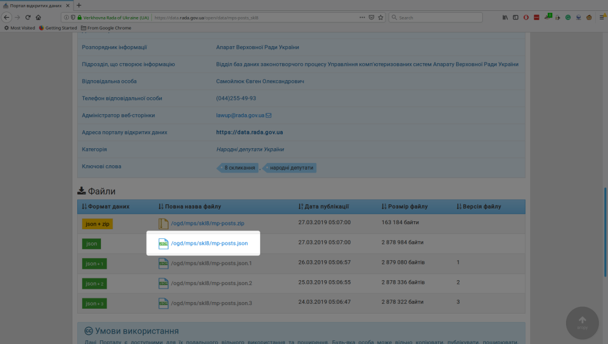

```{r setup, include=FALSE}
knitr::opts_chunk$set(echo = TRUE)
```

```{r message=FALSE, warning=FALSE, include=FALSE}
library(purrr)
library(dplyr)
library(stringr)
library(readr)
```

## Who I am?
* Data analyst  
* Former parliamentary analyst in [chesno.org](www.chesno.org) watchdog
* Some sort of data visualization specialist
* Experienced R user    

## Who I am not?
* SNA guru
* Web developer

## What are we going to do?
Develop web application that shows connection between Ukrainian MPs, based on a joint submission of bills.

## Most of the bills are initiated by small or large group of MPS


## Most of the bills are initiated by small or large group of MPS


## The amount of registered bills is really large and steadily growing


## Problem: How to visualize connection of bills initiators and avoid "hairballs" like this?


## My solution: give user an ability to choose, what amount of bills should be minimal to show cooperation between MPs
With threshold = 50


## Released version, made with duct tape and bubble gum:  
<font size="3"><a href = "https://groups.chesno.org">groups.chesno.org</a></center>  

## Our plan  
1. Get raw data and explore them.  
2. Transform them into data we need in order to create graphs.   
3. Create and visualize graphs locally. 
4. Wrap functions into interactive web application.
5. Publish out application.

#  1.Getting data

## Parliamentaty Open Data Portal
<font size="3"><a href = "https://data.rada.gov.ua">data.rada.gov.ua</a></center>  

  
## Getting data on registered bills


## Getting data on registered bills


## Getting data on registered bills


## Getting data on registered bills


## Getting data on registered bills


## Importing .json in R
```{r json reading}
library(jsonlite)
bills_json <- fromJSON("bills-skl8.json", simplifyDataFrame = FALSE)
print(length(bills_json))
glimpse(bills_json[[1]])
```

## Lists from .json files can also be explored using View() function in RStudio


## Getting data on factions and groups


## Getting data on factions and groups


## Getting data on factions and groups


## Getting data on factions and groups


## Data structure on mps are much simplier, so we can read it directly to data.frame
)
```{r}
mps_posts <- fromJSON("mp-posts.json", simplifyDataFrame = TRUE)
glimpse(mps_posts)

```


#  2.Transforming data
```{r include=FALSE}
na_if_null <- function(x) {
    x[is.null(x)] <- NA
    x
}
```

## Fields we need from bills list
1. Initiator's name and identifier
2. Bill's identifier
3. Department (to be able to filer bill's area)
4. Bill's type (whether it is project of law or other document)

## Function to get data frame with needed fields from list of bills
```{r get_bills_tow, echo=TRUE}
get_bills_rows <-  function(x) {
    initiators <- map_dfr(x$initiators, function(y) {
        if ("official" %in% names(y)) {
            data.frame(
                init_id = na_if_null(y$official$person$id),
                init_fullname = str_trim(paste(y$official$person$surname, y$official$person$firstname, y$official$person$patronymic)))
        } else {
            if ("outer" %in% names(y)) {
                data.frame(
                    init_id = na_if_null(y$outer$person$id),
                    init_fullname = str_trim(paste(y$outer$person$surname, y$outer$person$firstname, y$outer$person$patronymic)))
            } else {
                data.frame(
                    init_id = na_if_null(y$person$id),
                    init_fullname = str_trim(paste(y$person$surname, y$person$firstname, y$person$patronymic)))
            }
        }
    })
    initiators %>% 
        mutate(
            number = as.character(x$number),
            department = na_if_null(x$mainExecutives$executive$department),
            type = x$type
        )
}
```
## Step 1:
Extracting id and fullname of each initiator as data.frame rows
```{r echo=TRUE, eval=FALSE}
function(y) {
        if ("official" %in% names(y)) {
            data.frame(
                init_id = na_if_null(y$official$person$id),
                init_fullname = str_trim(paste(y$official$person$surname, y$official$person$firstname, y$official$person$patronymic)))
        } else {
            if ("outer" %in% names(y)) {
                data.frame(
                    init_id = na_if_null(y$outer$person$id),
                    init_fullname = str_trim(paste(y$outer$person$surname, y$outer$person$firstname, y$outer$person$patronymic)))
            } else {
                data.frame(
                    init_id = na_if_null(y$person$id),
                    init_fullname = str_trim(paste(y$person$surname, y$person$firstname, y$person$patronymic)))
            }
        }
    }
```

## Step 2:
Applying the function to list of initiators
```{r include=FALSE}
library(purrr)
x <- bills_json[[1]]
```

```{r echo=TRUE, warning=FALSE}
initiators <- map_dfr(x$initiators, function(y) {
    if ("official" %in% names(y)) {
        data.frame(
            init_id = na_if_null(y$official$person$id),
            init_fullname = str_trim(paste(y$official$person$surname, y$official$person$firstname, y$official$person$patronymic)))
    } else {
        if ("outer" %in% names(y)) {
            data.frame(
                init_id = na_if_null(y$outer$person$id),
                init_fullname = str_trim(paste(y$outer$person$surname, y$outer$person$firstname, y$outer$person$patronymic)))
        } else {
            data.frame(
                init_id = na_if_null(y$person$id),
                init_fullname = str_trim(paste(y$person$surname, y$person$firstname, y$person$patronymic)))
        }
    }
})
initiators

```

## What is map_dfr?
map_dfr(.x, .f, ..., .id = NULL)  
Function from purrr package. It means: take data.frames that was produced by each iteration of the function and bind them by rows.
```{r}

```

## Step 3:
Adding information on bill to initiators table
```{r}
    initiators %>% 
        mutate(
            number = as.character(x$number),
            department = na_if_null(x$mainExecutives$executive$department),
            type = x$type
        )
```
## Explanation: pipelines (dplyr library)
%>% means "make an expression on the left an argument of a function on the right"
```{r}
c(2, 2) %>% sum()
```
equals
```{r}
sum(c(2,2))
```

## What is na_if_null?
Simple function, written to avoid errors of different number of values in data.frame columns
```{r}
na_if_null <- function(x) {
    x[is.null(x)] <- NA
    x
}
```

## Applying function to the whole list
```{r message=FALSE, warning=FALSE}
all_init <- map_dfr(bills_json, get_bills_rows)
glimpse(all_init)
```

## Structure of data frame with edges we want to get
```{r echo=FALSE, message=FALSE, warning=FALSE, paged.print=TRUE}
read_csv("init.csv")
```
First two columns indicates MPs, the third - the number of bills they sumbitted together

## The code to create this table
```{r}
initiators.y <- all_init %>% 
    select(number, init_fullname)

init <-  all_init %>% 
    filter(type == "Проект Закону") %>%
    inner_join(y = initiators.y, by = "number") %>% 
    filter(init_fullname.x != init_fullname.y) %>% 
    group_by(init_fullname.x, init_fullname.y) %>% 
    count() %>% 
    mutate(pair = (
        sort(c(init_fullname.x, init_fullname.y)) %>% paste0(collapse = "|")
        )) %>% 
    group_by(pair) %>% 
    mutate(order = seq_along(pair)) %>% 
    filter(order == 1) %>% 
    ungroup() %>% 
    select(-pair, -order)
```

## Step 1. Creating auxiliary table with two columns only
```{r}
initiators.y <- all_init %>% 
    select(number, init_fullname)
glimpse(initiators.y)
```

## Step 2. Leaving only "projects of laws" in data.frame
```{r}

init <-  all_init %>% 
    filter(type == "Проект Закону")
glimpse(init)
```

## Step 3. "Multiplaying" data.frame so each row indicates joint submission of specific bill by a pair of MPs
```{r}
init <- init %>% 
    inner_join(y = initiators.y, by = "number")
glimpse(init)
```
## Step 4. Removing rows where MPs cooperating with themselves
```{r}
init <- init %>% 
    filter(init_fullname.x != init_fullname.y)
glimpse(init)

```

## Step 5. Grouping by pairs and counting number of rows in each pair
```{r}
init <- init %>% 
    group_by(init_fullname.x, init_fullname.y) %>% 
    count()
glimpse(init)
```

## Step 6. Removing duplicates with inversed order
```{r}
init <-  init %>% 
    mutate(pair = (
        sort(c(init_fullname.x, init_fullname.y)) %>% paste0(collapse = "|")
    )) %>% 
    group_by(pair) %>% 
    mutate(order = seq_along(pair)) %>% 
    filter(order == 1) %>% 
    ungroup() %>% 
    select(-pair, -order)
glimpse(init)
```
```{r include=FALSE}
init <-  all_init %>% 
    filter(type == "Проект Закону") %>%
    inner_join(y = initiators.y, by = "number") %>% 
    filter(init_fullname.x != init_fullname.y) %>% 
    group_by(init_fullname.x, init_fullname.y) %>% 
    count()
```


## Step 6.1. Creating new column "pair", which is the same for A -- B and B -- A edges
```{r message=FALSE, warning=FALSE}
init %>% 
    mutate(pair = (
        sort(c(init_fullname.x, init_fullname.y)) %>% paste0(collapse = "|")
    ))
```
## Step 6.2. Grouping by this column
```{r message=FALSE, warning=FALSE}
init %>% 
    mutate(pair = (
        sort(c(init_fullname.x, init_fullname.y)) %>% paste0(collapse = "|")
    )) %>% 
    group_by(pair)
```
## Step 6.3. Numbering rows withing each group (there are 2 rows for every pair)
```{r message=FALSE, warning=FALSE}
init %>% 
    mutate(pair = (
        sort(c(init_fullname.x, init_fullname.y)) %>% paste0(collapse = "|")
    )) %>% 
    group_by(pair) %>% 
    mutate(order = seq_along(pair)) 
```
## Step 6.4. Leaving only first row of each pair in the table
```{r message=FALSE, warning=FALSE}
init %>% 
    mutate(pair = (
        sort(c(init_fullname.x, init_fullname.y)) %>% paste0(collapse = "|")
    )) %>% 
    group_by(pair) %>% 
    mutate(order = seq_along(pair)) %>% 
    filter(order == 1) 
```
## Step 6.5. Ungrouping and removing auxiliary columns
```{r message=FALSE, warning=FALSE}
init <- init %>% 
    mutate(pair = (
        sort(c(init_fullname.x, init_fullname.y)) %>% paste0(collapse = "|")
    )) %>% 
    group_by(pair) %>% 
    mutate(order = seq_along(pair)) %>% 
    filter(order == 1) %>% 
    ungroup() %>% 
    select(-pair, -order)
```


## Structure of data frame with vertices we want to get
```{r echo=FALSE, message=FALSE, warning=FALSE}
read_csv("mps_chunk.csv") %>% glimpse()
```
bills_number - total amount of bills initiated by MP

## Code to create this data.frame
```{r}
bills_number <- all_init %>% 
    group_by(init_id, init_fullname) %>% 
    count() %>% 
    rename(bills_number = n)


mps <- mps_posts %>% 
    select(full_name, mp_id) %>% 
    distinct() %>% 
    left_join(mps_posts %>% 
                  filter(unit_type %in% c("fra", "grp")) %>% 
                  select(mp_id, full_name, unit_name) %>% 
                  distinct()) %>% 
    mutate(unit_name = case_when(
        is.na(unit_name) ~ "Позафракційні",
        TRUE ~ unit_name)) %>% 
    mutate(full_name = str_trim(full_name)) %>% 
    left_join(bills_number, by=c("mp_id" = "init_id", "full_name" = "init_fullname")) %>% 
    arrange(full_name)
```

## To know more about data transformation
[https://github.com/rstudio/cheatsheets/raw/master/data-transformation.pdf](https://github.com/rstudio/cheatsheets/raw/master/data-transformation.pdf)


# 3. Creating and visualizing graphs

## Loading libraries
```{r message=FALSE, warning=FALSE}
library(igraph)
library(ggraph)
library(networkD3)
library(tidyr)
```

## Reminder: edges are in init, vertices are in mps
```{r}
glimpse(init)
```
```{r}
glimpse(mps)
```

## To select only pairs with intensive collaboration we use dplyr::filter() function
```{r}
filter(init, n > 100) 
```
## To create graph - igraph::graph_from_data_frame() function
```{r}
filter(init, n > 100) %>% 
    graph_from_data_frame()

```

## Exploring the graphs with ggraph library
```{r message=FALSE, warning=FALSE}
filter(init, n > 100) %>% 
    graph_from_data_frame() %>% 
    ggraph() + 
    geom_edge_link() + 
    geom_node_point() + 
    theme_void()
```

## If we want to show factions, we need to add information about vertices
```{r message=FALSE, warning=FALSE, echo=F}
filter(init, n > 100) %>% 
    graph_from_data_frame(vertices = mps) %>% 
    ggraph() + 
    geom_edge_link() + 
    geom_node_point(aes(col = unit_name)) + 
    theme_void()
```

## Problem: we need to show factions but do not need disconnected vertices
function that solves this problem
```{r}
create_graph <- function(edges, vertices) {
    edges <- edges %>% 
        filter(init_fullname.x %in% vertices$full_name,
               init_fullname.y %in% vertices$full_name)
    v_in_edges <-edges %>% 
        gather(key = vert_type, value = vertice, init_fullname.x:init_fullname.y) %>% 
        select(vertice) %>% 
        distinct() %>% 
        pull()
    vertices <- vertices %>% 
        filter(full_name %in% v_in_edges)
    
    g <- graph_from_data_frame(edges, vertices = vertices)
    g
}
```

## What tidyr::gather() does?
```{r}
init %>% 
    gather(key = vert_type, value = vertice, init_fullname.x:init_fullname.y) %>% 
    glimpse()
```
```{r include=FALSE}
edges <- filter(init, n > 100)
vertices <- mps
```
## Step 1: Exclude edges that mention vertices outside the table
```{r}
edges <- edges %>% 
    filter(init_fullname.x %in% vertices$full_name,
           init_fullname.y %in% vertices$full_name)
glimpse(edges)
```

## Step 2: Extract list of vertices that are in edges data.frame
```{r}
v_in_edges <-edges %>% 
        gather(key = vert_type, value = vertice, init_fullname.x:init_fullname.y) %>% 
        select(vertice) %>% 
        distinct() %>% 
        pull()
glimpse(v_in_edges)
```
## Step 3: Exclude vertices that have no connections
```{r}
vertices <- vertices %>% 
    filter(full_name %in% v_in_edges)
glimpse(vertices)
```

## Step 4: Create and return the graph
```{r}
    g <- graph_from_data_frame(edges, vertices = vertices)
    g
```

## Library, used for visualization - networkD3
igraph_to_networkD3() creates network from igraph object
```{r message=FALSE, warning=FALSE, paged.print=TRUE}
 igraph_to_networkD3(g, group = get.vertex.attribute(g, "unit_name")) %>% 
    glimpse()

```
## Library, used for visualization - networkD3
...forceNetwork() shows it

```{r}
network <- igraph_to_networkD3(g, group = get.vertex.attribute(g, "unit_name"))
    forceNetwork(Links = network$links, Nodes = network$nodes, Source = "source", Target = "target", 
                 NodeID = "name", Group = "group", legend = TRUE, opacity = 0.9, fontSize = 13, 
                 bounded = TRUE, charge = -15)
```

## Function that takes edges and lists as arguments and visualize network
```{r}
mps_force_network <- function(edges, vertices) {
    g <- create_graph(edges, vertices)
    network <- igraph_to_networkD3(g, group = get.vertex.attribute(g, "unit_name"))
    network$nodes$size <- get.vertex.attribute(g, "bills_number") / max(get.vertex.attribute(g, "bills_number")) * 100
    forceNetwork(Links = network$links, Nodes = network$nodes, Source = "source", Target = "target", 
                 NodeID = "name", Group = "group", Nodesize = "size", legend = TRUE, opacity = 0.9, fontSize = 13, 
                 bounded = TRUE, charge = -15)
}
```

## Let's see how it works
filtering by number of common bills
```{r}
mps_force_network(filter(init, n > 50), mps)
```

## Let us add filter on factions
```{r}
mps_force_network(filter(init, n > 20), filter(mps, unit_name == "Позафракційні"))

```

# 4. Making it interactive

## Task: Provide user interface for n threshold and faction title input
```{r}
library(shiny)
```

## What is Shiny?
Shiny is an easy way to create web application using R without knowledge of server technologies, javascript, css and even html.

## Almost everything is written in two nested functions
  
ui() is responsible for input and output elements
server() - for the constructing output

## Creating new shiny app
  

## Creating new shiny app
  


## Creating new shiny app
  
```{r}
#
# This is a Shiny web application. You can run the application by clicking
# the 'Run App' button above.
#
# Find out more about building applications with Shiny here:
#
#    http://shiny.rstudio.com/
#

library(shiny)
library(dplyr)
library(tidyr)
library(networkD3)
library(igraph)
library(stringr)

source("functions.R")
load("mps.Rda")
load("init.Rda")
# Define UI for application that creates networks
ui <- fluidPage(
   
   # Application title
   titlePanel("MPs' networks"),
   
   # Sidebar with a slider and checkboxGroup input
   sidebarLayout(
      sidebarPanel(
         sliderInput("bills_threshold",
                     "Minimal number of shared bills:",
                     min = 1,
                     max = 100,
                     value = 40),
         checkboxGroupInput("factions",
                            label = "Choose factions you want to see:",
                            # 
                            choices = unique(mps$unit_name), 
                            selected = unique(mps$unit_name))
      ),
      
      mainPanel(
          forceNetworkOutput("networkPlot")
      )
   )
)

# Define server logic 
server <- function(input, output) {
   
   output$networkPlot <- renderForceNetwork({
       mps_force_network(filter(init, n >= input$bills_threshold), 
                         filter(mps, mps$unit_name %in% input$factions))
   })
}

# Run the application 
shinyApp(ui = ui, server = server)


```

## Room for improvement - filtering by parliamentary committees
1. On creating data stage keep the information on "main executives" (list are better than data.frame).
2. Create selectInput on shiny UI.
3. Add additional filtering in renderForceNetwork() function in server part.


# 5. Publishing

## What do we need to share our app?
1. Register on shinyapps.io

## What do we need to share our app?
2. Copy access token and secret


## What do we need to share our app?
3. Run in RStudio
```{r eval=FALSE}
install.packages('rsconnect')
library(rsconnect)
rsconnect::setAccountInfo(name="<ACCOUNT>", token="<TOKEN>", secret="<SECRET>")
```

## What do we need to share our app?
4. Click in RStudio when app is open


## Limitations of free version - 24 hours per account/month
If you need more - it is better run your own server than pay for paid version

## References
The variety of cheatsheets:  
[www.rstudio.com/resources/cheatsheets/](https://www.rstudio.com/resources/cheatsheets/)  
Shiny section:  
[shiny.rstudio.com/](https://shiny.rstudio.com/)  
Contact me:  
paul.myronov@gmail.com  
[fb.com/pavlo.myronov](https://fb.com/pavlo.myronov)  